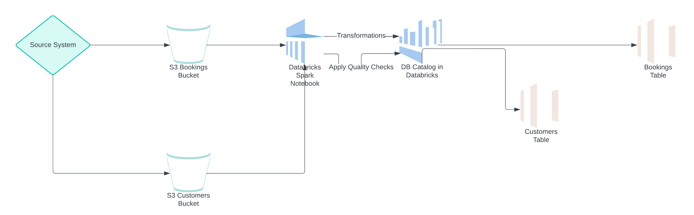

# Bookings Data Processing

This project processes booking and customer data using Apache Spark, Delta Lake, and the PyDeequ library for data quality checks. It involves reading data from CSV files, performing data quality verifications, transforming the data, and writing it to Delta tables.

## Requirements

- Apache Spark 3.x
- Delta Lake
- PyDeequ
- Python 3.x

### Diagram

## Data Sources

- **Booking Data**: CSV file located in `s3 bucket`.
- **Customer Data**: CSV file located in `s3 bucket`.

## Data Quality Checks

The project employs data quality checks using **PyDeequ** to ensure the integrity and quality of the data before processing. 

### Booking Data Checks

- **Unique Booking IDs**: 
  - Ensures that each `booking_id` is unique throughout the dataset.
  
- **Completeness**: 
  - Verifies that critical fields are complete:
    - `customer_id`
    - `amount`
  
- **Non-Negativity**: 
  - Checks that numerical fields have non-negative values:
    - `amount`
    - `quantity`
    - `discount`

### Customer Data Checks

- **Unique Customer IDs**: 
  - Ensures that each `customer_id` is unique within the dataset.
  
- **Completeness**: 
  - Verifies that essential fields are complete:
    - `customer_name`
    - `customer_address`
    - `phone_number`
    - `email`

## Data Transformation

After passing the quality checks, the data undergoes several transformations:

1. **Ingestion Timestamp**: 
   - An ingestion timestamp is added to the DataFrame to track when the data was processed.

2. **Business Logic Application**: 
   - Business logic is applied to calculate the total cost. The total cost is derived from the `amount` minus the `discount`.
   - Records are filtered to retain only those with a positive quantity.

3. **Aggregations**: 
   - Aggregations are performed based on `booking_type` and `customer_id`, summarizing the total cost and quantity for each group.

## Delta Table Operations

### Fact Table

- **Existence Check**: 
  - The code checks if the fact table already exists in the Delta format.

- **Combining Data**: 
  - If the fact table exists:
    - The new aggregated data is combined with the existing records using `unionByName`, which allows for any missing columns.
  - If the fact table does not exist:
    - The newly transformed data is used directly as the fact table.

### Slowly Changing Dimension (SCD) Table

- **Existence Check**: 
  - The code checks if the SCD table already exists in the Delta format.

- **Merge Operation**: 
  - If the SCD table exists, a merge operation is performed to update records as necessary. This operation updates the `valid_to` date for existing records that match the incoming data based on `customer_id`.

